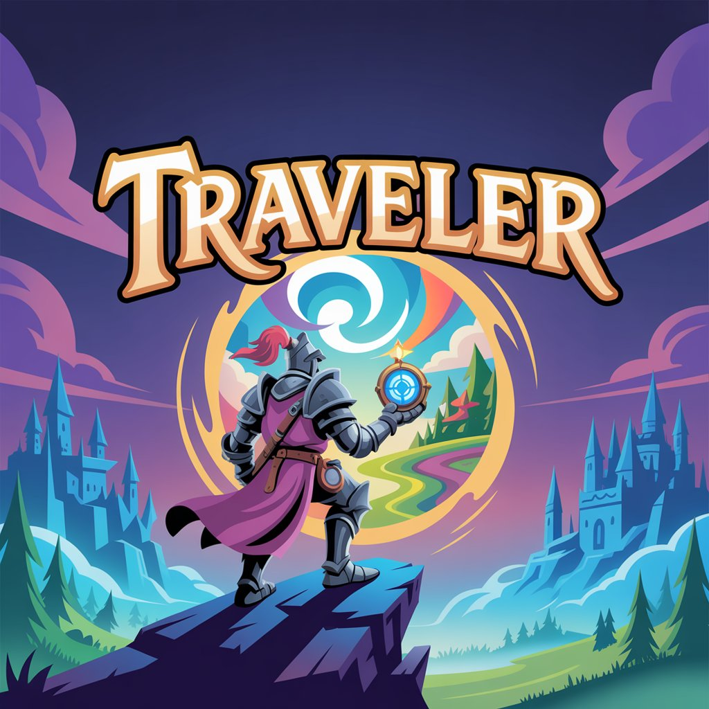

# Supercell_Gamejam_Hackathon_2025
This repository holds the Hackathon team Boolean Boys code

# AI-Powered Visual Novel Game



## Overview

This project is an interactive visual novel game that uses Google's Gemini AI to generate dynamic character responses based on player choices. The game features multiple characters with distinct personalities and traits, various backgrounds, and an evolving dialogue system that creates a unique storytelling experience each time you play.

## Features

- **AI-Powered Dialogue**: Characters respond naturally to your choices using Google Gemini AI
- **Multiple Characters**: Interact with a variety of characters, each with unique personalities and traits
- **Dynamic Environments**: Explore different locations that influence character interactions
- **Branching Conversations**: Your choices affect how characters respond and react to you
- **Customizable Settings**: Adjust display resolution to fit your preferences

## Requirements

- Python 3.7+
- Pygame
- Google Generative AI Python SDK
- **Google Gemini API Key** (required to run the game)

## Installation

1. Clone this repository:
   ```bash
   https://github.com/ArminKuburas/Supercell_Gamejam_Hackathon_2025
   ```

2. Install required dependencies:
   ```bash
   pip install pygame google-generativeai
   ```

3. Obtain a Google Gemini API key:
   - Visit [Google AI Studio](https://ai.google.dev/)
   - Create an account or sign in
   - Generate an API key from the dashboard

## Usage

1. Run the game:
   ```bash
   python3 main.py
   ```

2. When prompted, enter your Google Gemini API key (input will be hidden for security)

3. Navigate through the game:
   - **Main Menu**: Choose to play, adjust options, or quit
   - **Options Menu**: Adjust display resolution
   - **Gameplay**: Click on dialogue options to interact with characters
   - After 5 conversation exchanges, you'll be prompted to choose a new location

```

## The Idea

The project's goal was to customize a narrative experience for the player. The AI system may be constrained by parameters such as NPC characteristics, location, mood and theme in order to force the AI into adhering to a more strict linear way of storytelling. Alternatively such guardrails may be reduced or altogether removed to give the player a more unique and non-linear experience.

## Use Cases

One of the scenarios for using AI as a storyteller would be in open world game development, where the creators wish to provide a more immersive experience to the player by making various NPCs react to a variety of player actions localized to parts of the world. This would mean that in a large environment the player could have different levels of fame or infamy in differing townships or subcontinents.

Another case would be to use the AI to generate constantly expanding progression paths. Imagine a game with a cooldown system where the player is enticed to return for additional rewards on the progression path. The reward is a single motivator for most players in this case which may get tedious or boring over time in which case an AI catered experience may substitute the need for additional reward systems.

## Privacy Note

This application requires a Google Gemini API key to function. Your conversations with in-game characters are processed through Google's AI services. Please review Google's privacy policy regarding their AI services before using this application.

## License

[MIT License](LICENSE)

## Acknowledgments

- This project uses Google's Gemini AI for natural language processing
- Character and background assets [attribution to be added]
- Special thanks to all contributors and testers
